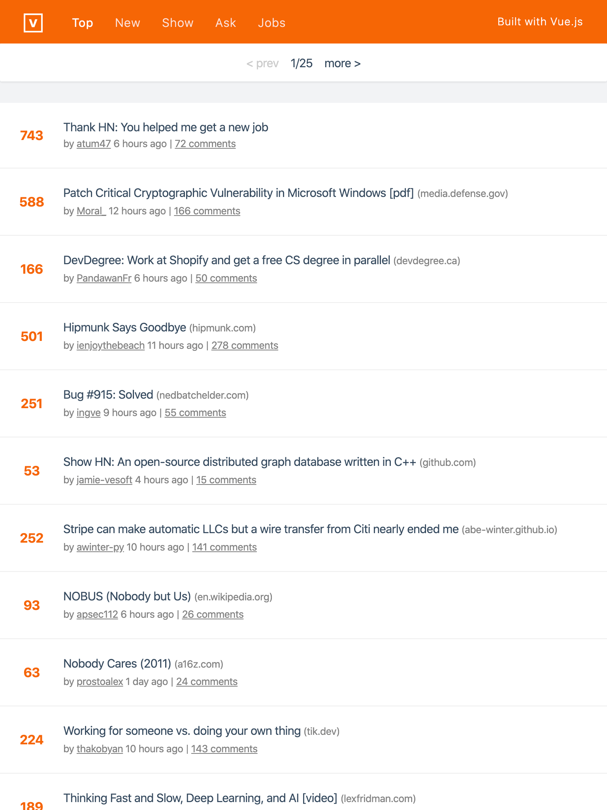
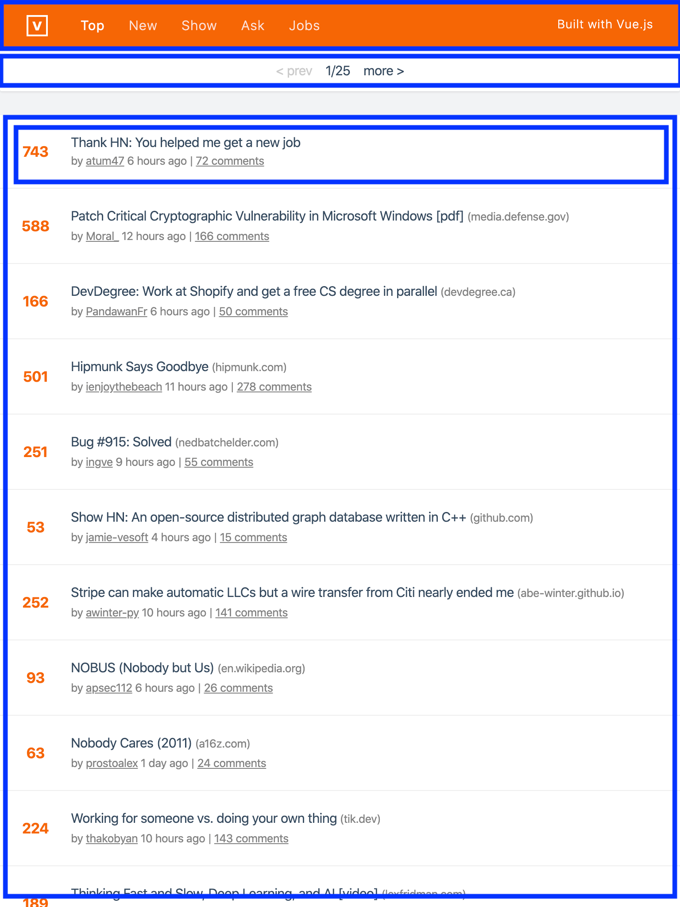

# Lesson 3

We write Vue components inside `.vue` files within our `src` directory. Such a file is called a _Single File Component_ or _SFC_ in Vue. A Vue component is a logical grouping of related styles, logic and markup required to render itself. If we open `App.vue` for example, we can see all these 3 pieces as distinct groups:

```vue
<template>
  <div>This is where the markup goes!</div>
</template>

<script>
  // We can import other JS files as well as Vue components
  import HelloWorld from './components/HelloWorld.vue';

  // This is where we export the component object and define any logic that's
  // necessary to render this component
  export default {
    name: 'app',

    // We define any external components being nested within the current component
    // in this section.
    components: {
      HelloWorld
    }
  }
</script>

<style>
  div {
    color: red;
  }
</style>
```

This makes it easy to make changes to a component and reduces the mental overhead of having to remember arcane folder structures and more.

The nice thing about this structure is that at build time, each of these blocks can be processed differently. This allows for flexibility of choosing a different markup language for the `<template>` block, say Pug or EJS. Or, you could use TypeScript for the `<script>` block and SCSS for the `<style>` block. We'll be keeping it simple in this workshop but you can explore these options later.

Let's remove the `HelloWorld` component that the CLI generated for us as well as remove the generated code in `App.vue` so that it looks like this:

```vue
<template>
  <div id="app">
  </div>
</template>

<script>
export default {
  name: 'app'
}
</script>

<style>
</style>
```

Let's see what we're trying to build:



You can check this link to see the actual Vue.js HackerNews app which is also a PWA. We won't be building this in full-detail and we won't be building all the sections in the nav-bar but you are encouraged to attempt to build these post-workshop.

We'll build the "Top" section first which is also the home page. For now, we'll build each and every component that's required for this and learn Vue concepts along the way. We'll also work with just dummy data for now and will see later how we can wire up to actual data from the public API.

## Analyzing the components

The first step is trying to identify what and all components we'd need to build by looking at the mockup we have. We can draw boxes around these sections which we feel are distinct in the page and those are our primary components. We definitely can go as small as possible while building our components but don't get worked up with this—just start with higher-level abstractions and build those first.



## Adding some default CSS

Let's first add some default CSS to make it a bit easier to build the components. First up, download the excellent `normalize.css` by Necolas Gallagher from https://raw.githubusercontent.com/necolas/normalize.css/master/normalize.css and add it into `src/assets/normalize.css`. This will give us a consistent styling experience across browsers.

Let's also create `src/assets/styles.css` and add a better default font system:

```css
body {
  font-family: -apple-system, BlinkMacSystemFont, 'Segoe UI', Roboto, Oxygen, Ubuntu, Cantarell, 'Open Sans', 'Helvetica Neue', sans-serif;
}
```

How do we get this in our Vue app? Let's simply add CSS imports to our `<style>` section in `App.vue` and Vue.js takes care of the rest!

```vue
<style>
@import "assets/normalize.css";
@import "assets/styles.css";

</style>
```

## Building the identified components

Let's create `.vue` files for these components we identified. Inside `src/components`, we create the following files:

- NavBar.vue
- Paginator.vue
- NewsList.vue
- NewsListItem.vue

Let's import some of these into `App.vue`:

```vue
<template>
  <div id="app">
    <NavBar />
    <NewsList />
  </div>
</template>

<script>
import NavBar from './components/NavBar';
import NewsList from './components/NewsList';

export default {
  name: 'app',

  components: {
    NavBar,
    NewsList
  }
}
</script>

<style>
</style>
```

Let's start with `NavBar.vue`. Open it and add the following content:

```vue
<template>
  <div class="navbar">
    <div class="logo">
      <span>V</span>
    </div>

    <ul class="navbar-links">
      <li>Top</li>
      <li>New</li>
    </ul>
  </div>
</template>

<script>
export default {

}
</script>

<style>
  .navbar {
    background: #F66605;
    color: #fff;
    display: flex;
    align-items: center;
    padding: 20px 40px;
  }

  ul {
    list-style: none;
    display: flex;
    margin: 0;
    padding: 0;
    margin-left: 20px;
  }

  .logo {
    font-weight: 700;
    height: 3ch;
    width: 3ch;
    border: 3px solid #fff;
    display: flex;
    align-items: center;
    justify-content: center;
  }

  li + li {
    margin-left: 10px;
  }
</style>
```

Save it and observe how the dev server automatically updates the preview with your changes. This is neat. You can also see how Vue scopes your styles by default if you open the inspector and check the styles generated for the HTML elements above.

## Filling in dummy data

Let's add some dummy data into our application for now so that the list view we're about to build has something to work with.

We can associate state/data with a component via the `data` property. Let's check `examples/03-adding-components/index.vue` file. Here's an awesome feature of `@vue/cli`: if you want to quickly prototype something, you don't need to generate a whole new project for that. Simply create a `.vue` file and run:

```sh
vue serve index.vue
```

..and that's it!

There are three key properties that we should be aware of when building a Vue component:

1. `data`: This allows us to associate state with a component. **This should always be a function** because when you reuse the component, Vue will instantiate the new component instance with the same definition. So, if it's a plain object, it will be shared across all the instances which is not what we want. So, make it a function which returns the state object.
2. `computed`: Many a times, we would want to display a value present in `data` in a different way. For example, instead of displaying `Date` value directly, we might want to format it using a library and show the relative time, i.e, _1 hour ago_. To help with these scenarios, define a function within the `computed` property object which returns a value. You can use the name of the function within your template just like you would use a `data` property. The advantage here is that Vue knows which `data` property you're depending on to generate the computed value and can intelligently cache this value and only re-render when the dependent `data` property changes.
3. `methods`: We can define arbitrary functions within `methods` object that can do anything and be used either in `<template>` or elsewhere in other methods or lifecycle methods. They get access to your `data` and `computed` properties. If you're using a method inside `<template>`, you might be able to do it more efficiently by turning it into a computed property instead.

Let's add an `items` property to `data` in `App.vue` which will contain the following dummy list of items:

```json
[
  {
    "title": "Thank HN: You helped me get a new job",
    "author": "atum47",
    "upvotes": 941,
    "timestamp": "2019-08-09T05:18:28.802Z",
    "commentCount": 357
  },
  {
    "title": "Patch Critical Cryptographic Vulnerability in Microsoft Windows [pdf] (media.defense.gov)",
    "author": "Moral_",
    "upvotes": 610,
    "timestamp": "2019-07-05T01:40:47.265Z",
    "commentCount": 344
  },
  {
    "title": "DevDegree: Work at Shopify and get a free CS degree in parallel (devdegree.ca)",
    "author": "PandawanFr",
    "upvotes": 190,
    "timestamp": "2019-08-01T19:59:59.050Z",
    "commentCount": 9
  },
  {
    "title": "Hipmunk Says Goodbye (hipmunk.com)",
    "author": "ienjoythebeach",
    "upvotes": 516,
    "timestamp": "2019-09-20T21:49:18.323Z",
    "commentCount": 112
  },
  {
    "title": "Apple can be sued by app developers “on a monopsony theory.” (npr.org)",
    "author": "moorage",
    "upvotes": 36,
    "timestamp": "2019-09-20T12:20:19.440Z",
    "commentCount": 315
  },
  {
    "title": "Bug #915: Solved (nedbatchelder.com)",
    "author": "ingve",
    "upvotes": 273,
    "timestamp": "2019-06-05T00:20:03.958Z",
    "commentCount": 134
  },
  {
    "title": "Show HN: A pure reference counting GC in Go (github.com)",
    "author": "sendilkumarn",
    "upvotes": 17,
    "timestamp": "2019-08-12T06:52:43.795Z",
    "commentCount": 425
  },
  {
    "title": "Stripe can make automatic LLCs but a wire transfer from Citi nearly ended me (abe-winter.github.io)",
    "author": "awinter-py",
    "upvotes": 259,
    "timestamp": "2019-07-10T19:43:22.348Z",
    "commentCount": 143
  },
  {
    "title": "Show HN: An open-source distributed graph database written in C++ (github.com)",
    "author": "jamie-vesoft",
    "upvotes": 66,
    "timestamp": "2019-07-30T19:21:12.041Z",
    "commentCount": 156
  },
  {
    "title": "NOBUS (Nobody but Us) (en.wikipedia.org)",
    "author": "apsec112",
    "upvotes": 107,
    "timestamp": "2019-07-21T22:47:48.729Z",
    "commentCount": 72
  },
  {
    "title": "Working for someone vs. doing your own thing (tik.dev)",
    "author": "thakobyan",
    "upvotes": 242,
    "timestamp": "2019-07-18T15:02:51.680Z",
    "commentCount": 62
  },
  {
    "title": "Nobody Cares (2011) (a16z.com)",
    "author": "prostoalex",
    "upvotes": 70,
    "timestamp": "2019-08-22T12:13:36.419Z",
    "commentCount": 301
  },
  {
    "title": "Get Me Off Your Fucking Mailing List [pdf] (scs.stanford.edu)",
    "author": "af16090",
    "upvotes": 83,
    "timestamp": "2019-06-08T19:49:47.661Z",
    "commentCount": 227
  },
  {
    "title": "Reusable vs. Re-editable Code (2018) [pdf] (hal.archives-ouvertes.fr)",
    "author": "akkartik",
    "upvotes": 16,
    "timestamp": "2019-08-18T04:36:18.428Z",
    "commentCount": 214
  },
  {
    "title": "Thinking Fast and Slow, Deep Learning, and AI [video] (lexfridman.com)",
    "author": "AlanTuring",
    "upvotes": 201,
    "timestamp": "2019-05-31T15:56:19.346Z",
    "commentCount": 114
  },
  {
    "title": "How the U.S. military thinks about AI [audio] (changelog.com)",
    "author": "killjoywashere",
    "upvotes": 32,
    "timestamp": "2019-06-30T23:20:07.371Z",
    "commentCount": 363
  },
  {
    "title": "How to Make a Raspberry Pi VPN Server (electromaker.io)",
    "author": "FoxMulder23",
    "upvotes": 170,
    "timestamp": "2019-08-02T21:40:47.105Z",
    "commentCount": 253
  },
  {
    "title": "Real-Time Ray-Tracing in WebGPU (maierfelix.github.io)",
    "author": "Schampu",
    "upvotes": 94,
    "timestamp": "2019-08-18T05:25:49.419Z",
    "commentCount": 367
  },
  {
    "title": "Life's clockwork: Scientist shows how molecular engines keep us ticking (phys.org)",
    "author": "lelf",
    "upvotes": 6,
    "timestamp": "2019-07-23T20:32:41.394Z",
    "commentCount": 229
  },
  {
    "title": "Video Gaming Will Take Over (matthewball.vc)",
    "author": "thesauri",
    "upvotes": 125,
    "timestamp": "2019-07-30T07:33:48.879Z",
    "commentCount": 247
  }
]
```

Now, we need to pass this data to the `NewsList` component and we'll see how we can do that in the next section.
